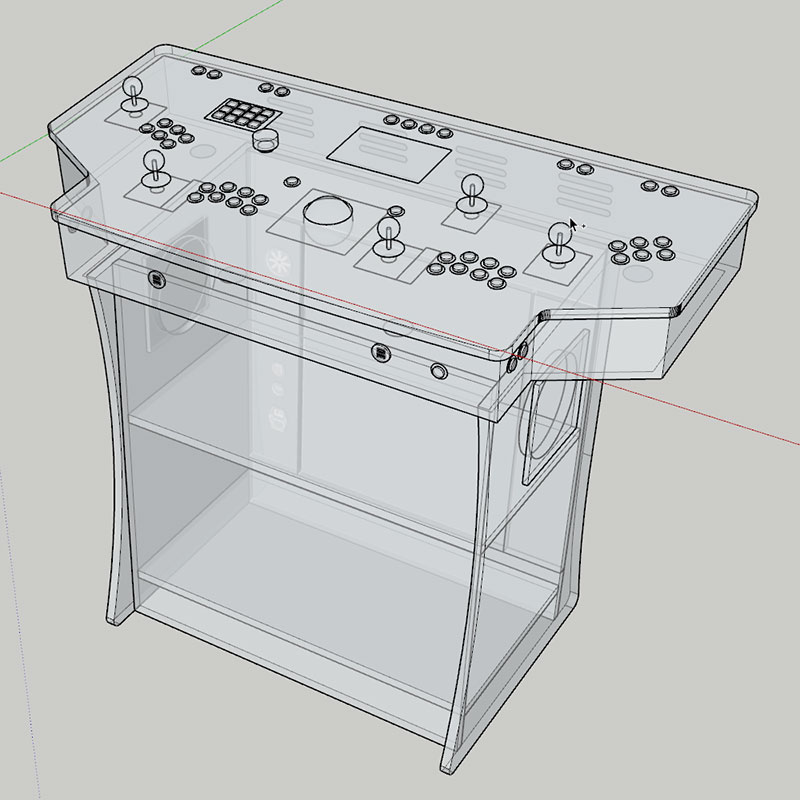

This web site documents my journey through building a high-end arcade pedestal, being a total noob in the process.  My end goal is to create this beauty in real life:

## Posts

<ul>
  
    <li>
		

			<a href="{{ post.url }}">{{ post.title }}</a>
			- {{ post.date | date: "%b %d, %Y" }}
		

		

			{{ post.excerpt | strip_html | truncatewords:50 }}
		

    </li>
  
  <li><i>More coming soon!</i></li>
</ul>
