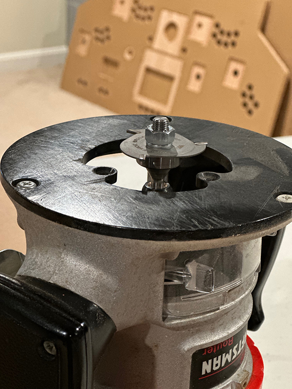
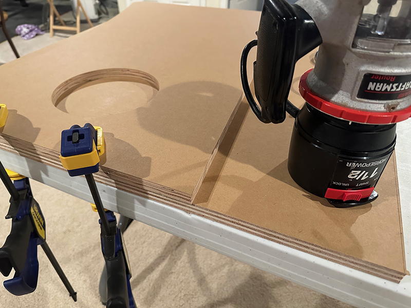
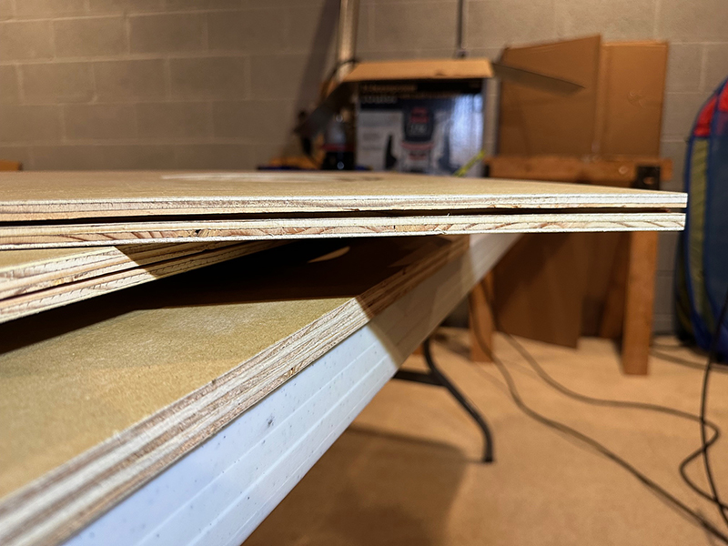
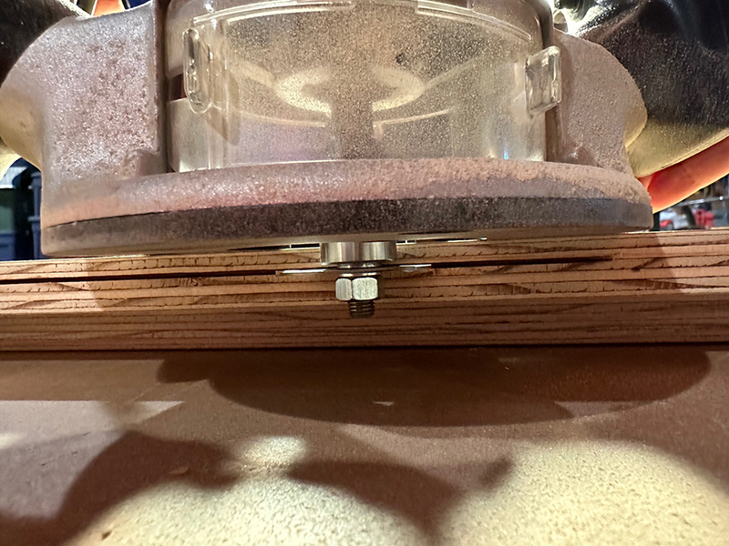
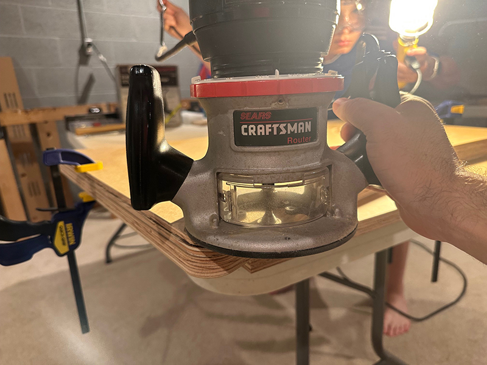
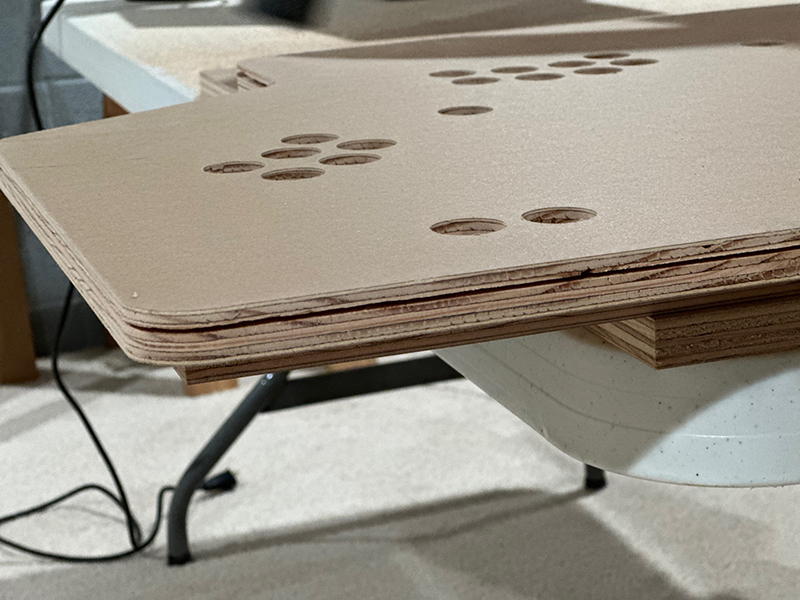
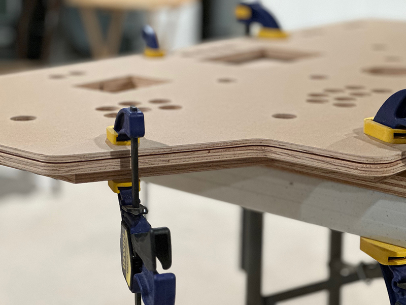
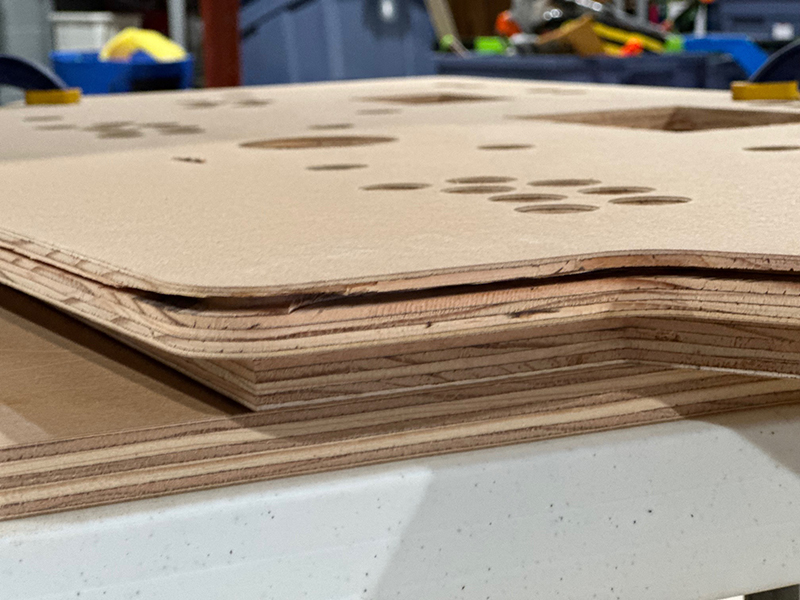

T-molding is a rounded plastic edging that can be run along the outside edges of wood boards.  The molding provides a smooth cap for an otherwise rough wooden edge, and is used in nearly all arcade cabinets.  T-molding has a fin that projects from the rounded cap and must be fit into a slot.  The slot is cut using a router and a special slotting cutter bit.

## T-Molding Anatomy

It didn't take long to determine that most people purchase their arcade cabinet T-molding from [t-molding.com](https://www.t-molding.com/).  I ended up ordering two 20' rolls of [3/4" black T-molding](https://www.t-molding.com/3-4in-black-t-molding.html) from them for this project.

This image from their site shows the T-molding specifications.

There is a rounded cap that covers the end of a 3/4" wood board and a fin extends into a slot to hold the molding in place.

## Slot Cutting Materials

The primary materials used in cutting T-molding slots are a router and a slotting cutter bit.

### Router

A router is a tool that spins an attached bit at a very high speed to shape, cut, or trim wood.  In this case, we attached a slotting cutter bit to the router.

### Slotting Cutter Bit

I purchased the Whiteside Slotting Cutter 1/16" 3-Wing bit, along with a Whiteside Slotting Cutter Arbor 1/4" Shank 2-3/8" Length.  After assembling these together and attaching the arbor shank to the router, I was ready to cut the slot.

## Boards Requiring Slots

Three boards required slots for T-molding:

- **Left pedestal side board** - 8' of molding needed
- **Right pedestal side board** - 8' of molding needed
- **Control panel top** - 12' of molding needed

The first 20' run of T-molding that was purchased would be used for the side boards and the second run would be used for the control panel top.

## The Routing Process

### Clamping

When preparing to route anything, it's extremely important to clamp everything in place.  Any movement of wood boards can be disastrous.  And as we'll see later, keeping the router flat on the board's surface when doing cuts around complicated corners can be challenging, also leading to major problems.

### Slot Location

After clamping the boards down, the router bit needs to be positioned properly.  In most cases, the router bit will want to extend directly over the middle of the woods edge being cut so that the T-molding will perfectly span the board.  The two pedestal side boards were cut in this way.

However the control panel top couldn't be cut in this fashion.  There will be a 3mm thick acrylic piece that sits on top of the control panel top.  I wanted the T-molding to cover the edges of that acrylic piece.  Therefore I had to shift the bit upward 3mm from board edge center to get the slot where it needed to be.

This left one issue.  Some of the wood board's lower edge would be visible under the T-molding.  What we did later on was to take another router bit that cut at a 45-degree angle, and ran that along the bottom of the control panel top board.  This created a chamfered edge that would taper away from the eyes and be minimally visible.

### Routing Direction

When routing, you need to determine the spin direction of the router and move slowly around the outside perimeter of the board in the direction where the router bit is cutting into the wood.

### Results

Overall the slot routing went very well and turned out as expected.

The slots were most difficult to cut around curves.

### Mistakes Made

I had two major mistakes occur while routing the slots on the boards.  The first was near a complex rounded portion of the control panel top board.  The second was near the end of one of the side boards.  In both cases, the router didn't remain flush on the resting surface of the board and started to rise up, making the slot move upward.  Unfortunately you can't tell when this happens until you've already gone several inches.

I made the difficult decision to go back and cut the slot properly after discovering the issue.  This meant that in a couple of boards, there was an area where the slot was now too wide.  We will have to compensate for this later on when inserting the T-molding by padding one side of the fin with tape or something else.

## Summary

Doing the T-molding slot cutting was one of the things that scared me most about this project, and it did not fail to deliver a couple big issues due to my novice skill with a router.  At least for the time being, I can kick solving the problem down the road.  But once this project is nearing completion, I'll need to find a way to secure the T-molding in place where the mistakes were made.

In the next post, we'll start priming and painting wood boards.
